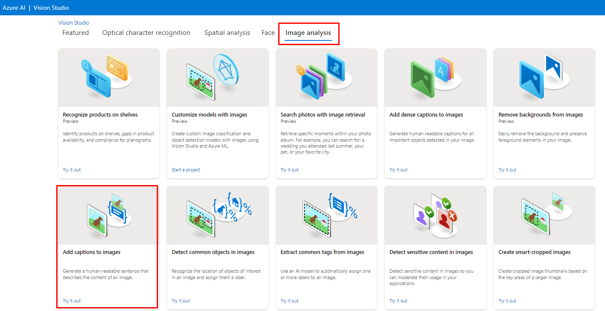
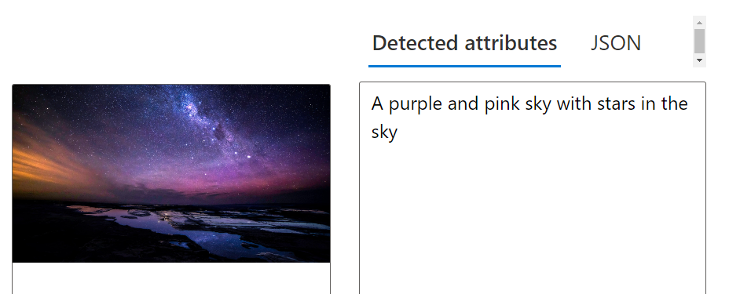
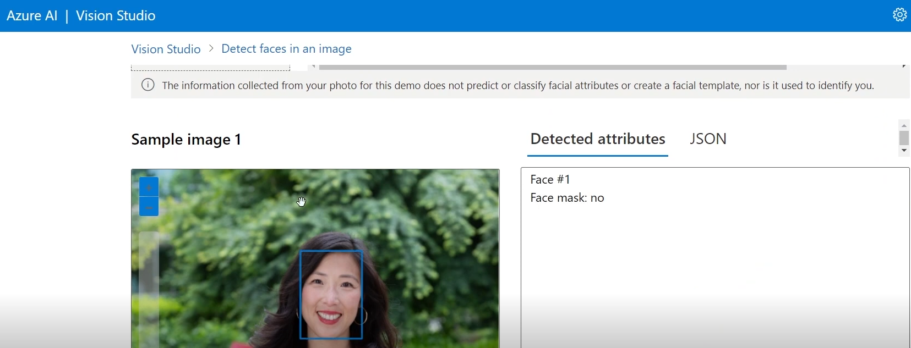
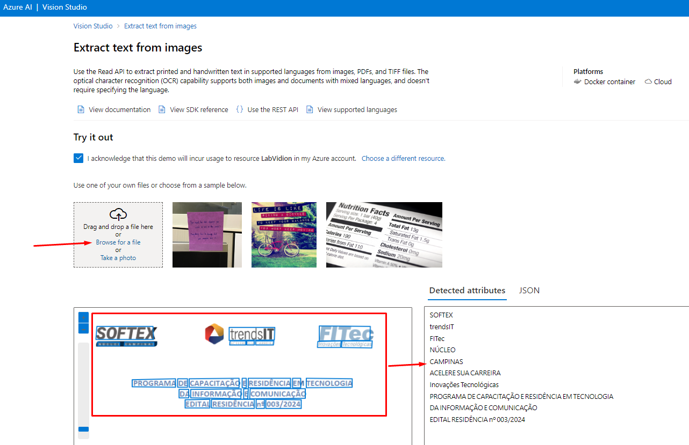

<h1>
    
     Reconhecimento Facial e transformação de imagens em Dados
</h1>

---

## Add captions to imagens

Através deste recurso a Inteligência Artificial descreve o que esta presente na imagem, possibilitando assim que deficientes visuais saibam o que esta presente na foto ou video.

Dentro do Vision Studio, na guia *Image analysis* clique na opção Add captions to imagens:

---

## Detect Face in an image

Por meio deste recurso, é possível reconhecer a presença de rostos humanos, contá-los e identificar características como se está ou não usando máscara.

---

## Optical character recognition

Através deste recurso a Inteligência Artificial extrai o texto que conseguir identificar na imagem, extremamente util para o escaneamento de documentos e notas:

01 - Dentro do Vision Studiona guia *Optical character recognition* clique na opção Extract text from images:   

---

02 - O recurso trás algumas imagens de exemplo para que você realize testes do serviço e até mesmo a possibilidade de realizar upload de uma , logo após o upload todo o texto contido na imagem aparece a direita:

---

## Considerações Finais

Tais recursos trazem inúmeras soluções para o dia a dia, o recurso de detecção e descrição da imagem enriquece ainda mais sistemas de segurança, os quais identificarão as faças de quem passar a frente das câmeras, assim como reconhecer rostos ja conhecidos.O recurso de estração de texto ajudará inumeras empresas a gerenciar seus arquivos antigos, assim como escanear e guardar dados de notas, facilitando assim a manutenção dos arquivos e o tempo para ter aesso aos mesmos.
