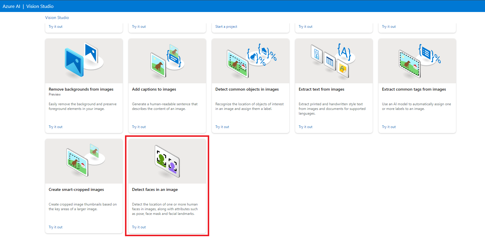
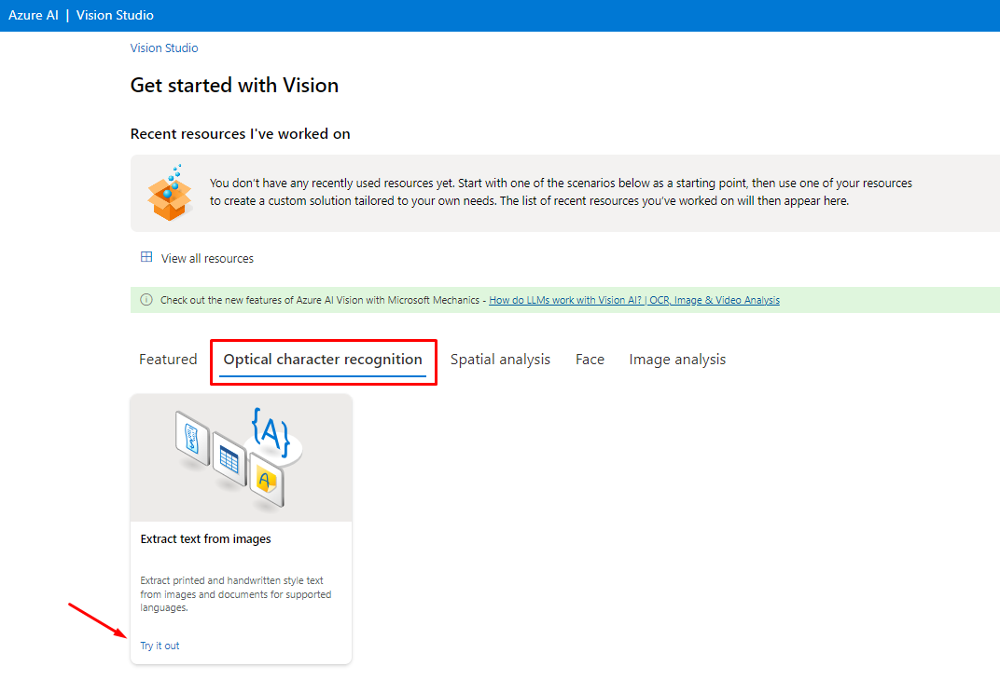

<h1>
    
     Reconhecimento Facial e transformação de imagens em Dados
</h1>

---

## Add captions to imagens

Através deste recurso a Inteligência Artificial descreve o que esta presente na imagem, possibilitando assim que deficientes visuais saibam o que esta presente na foto ou video.

Dentro do Vision Studio, na guia *Image analysis* clique na opção Add captions to imagens:

---

## Detect Face in an image

Por meio deste recurso, é possível reconhecer a presença de rostos humanos, contá-los e identificar características como se está ou não usando máscara.

---

## Optical character recognition

Através deste recurso a Inteligência Artificial extrai o texto que conseguir identificar na imagem, extremamente util para o escaneamento de documentos e notas:

01 - Dentro do Vision Studiona guia *Optical character recognition* clique na opção Extract text from images:   

---

02 - O recurso trás algumas imagens de exemplo para que você realize testes do serviço e até mesmo a possibilidade de realizar upload de uma , logo após o upload todo o texto contido na imagem aparece a direita:

---

## Considerações Finais

Os recursos oferecidos pela Microsoft Azure proporcionam uma variedade de soluções para os desafios do cotidiano.

A detecção de imagens, quando aplicada de forma inteligente, pode desempenhar um papel crucial na promoção da acessibilidade. Por exemplo, sistemas de detecção de imagem podem ser utilizados para auxiliar pessoas com deficiência visual, fornecendo descrições detalhadas do ambiente ao seu redor.

A funcionalidade de detecção de face pode oferece uma camada adicional de segurança aos sistemas, permitindo a identificação de indivíduos diante das câmeras e o reconhecimento de rostos previamente registrados.

Além disso, a capacidade de extração de texto possibilita que empresas gerenciem de forma eficiente seus arquivos antigos, digitalizando e armazenando dados de notas, simplificando assim a manutenção e o acesso aos documentos.

Essas ferramentas representam avanços significativos na otimização de processos e na agilidade operacional.
