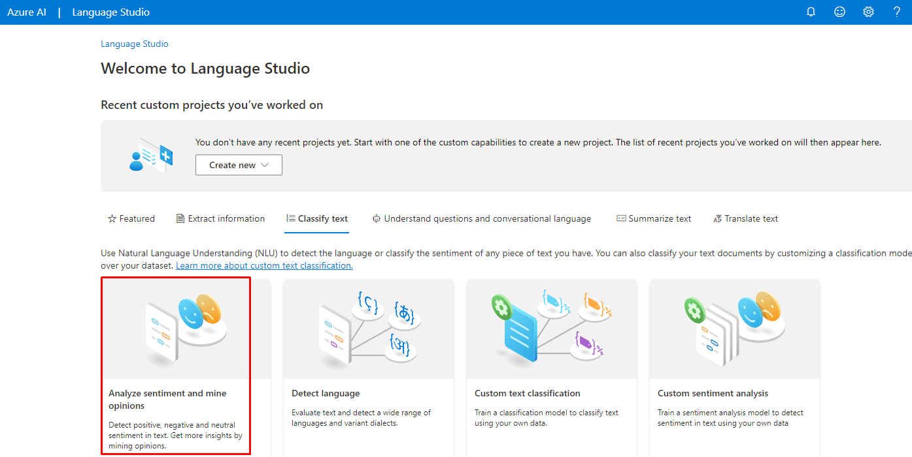

# Análise de Sentimentos com Language Studio da Microsoft Azure

## Analyze sentiment and mine opinions

A ferramenta "Analyze sentiment and mine opinions" do Microsoft Azure é uma poderosa solução de análise de sentimentos e mineração de opiniões que permite às empresas entenderem as percepções dos clientes em relação aos seus produtos, serviços e marca.

Utilizando algoritmos avançados de processamento de linguagem natural (NLP), a ferramenta é capaz de analisar grandes volumes de texto em tempo real, identificando e classificando automaticamente o sentimento expresso em cada mensagem, seja positivo, negativo ou neutro.

Além disso, ela pode extrair insights valiosos das opiniões dos clientes, identificando tendências, temas recorrentes e até mesmo detectando sarcasmo ou ironia. Com isso, as empresas podem tomar decisões mais informadas, melhorar a experiência do cliente e impulsionar o sucesso do negócio.

### Tutorial

---

---

---

---

---

## Considerações Finais

Após realizar o laboratório para praticar o uso da ferramenta "Analyze sentiment and mine opinions" do Microsoft Azure, algumas considerações e impressões podem ser destacadas:

- Facilidade de Uso: A interface da ferramenta é intuitiva e fácil de navegar, o que facilita o processo de análise de sentimentos e opiniões.
- Eficiência na Análise: A ferramenta demonstrou ser eficaz na análise de grandes volumes de texto, oferecendo resultados precisos e rápidos.
- Insights Valiosos: Os insights fornecidos pela ferramenta são extremamente úteis para entender as percepções dos clientes, identificar áreas de melhoria e tomar decisões estratégicas.
- Escalabilidade: A capacidade da ferramenta de lidar com grandes quantidades de dados a torna uma solução escalável para empresas de todos os portes.

No geral, a experiência com a ferramenta foi positiva e ela se mostrou uma aliada poderosa para empresas que buscam compreender e melhorar a experiência do cliente através da análise de sentimentos e opiniões.
