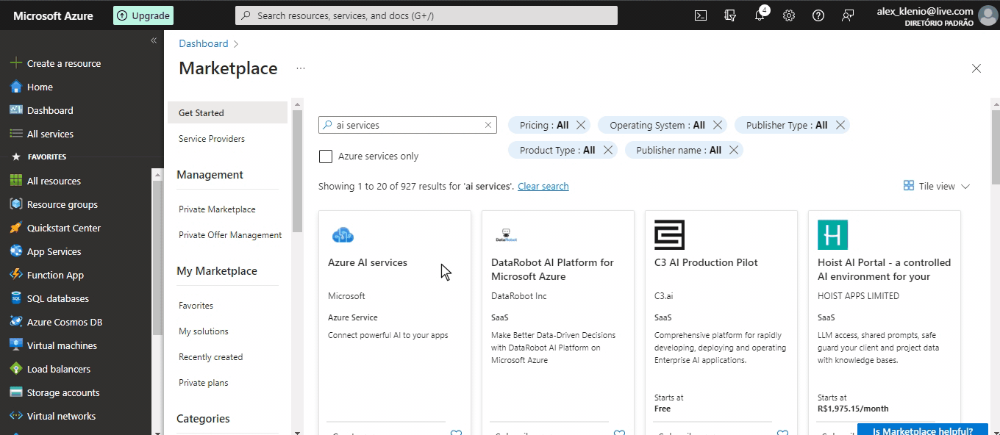
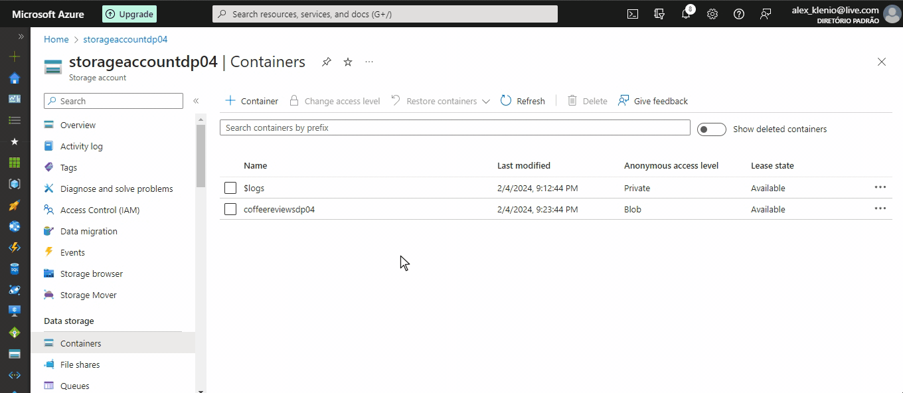

# Azure Cognitive Search: Utilizando AI Search para indexação e consulta de Dados

Nos últimos anos, a explosão de dados tem desafiado as organizações a encontrar maneiras eficientes de gerenciar e extrair valor dessas vastas quantidades de informações. Nesse cenário, soluções de busca baseadas em inteligência artificial (AI) têm se destacado como ferramentas poderosas para organizar, indexar e recuperar dados de forma rápida e precisa. O Azure Cognitive Search, uma oferta da Microsoft Azure, surge como uma solução abrangente e escalável para atender a essa demanda crescente.

O Azure Cognitive Search combina tecnologias avançadas de IA, como machine learning e processamento de linguagem natural, para oferecer recursos de busca inteligente que vão além das simples consultas de palavras-chave. Ao integrar algoritmos de aprendizado de máquina, o serviço é capaz de entender o contexto e as intenções por trás das consultas dos usuários, proporcionando resultados mais relevantes e personalizados.

Neste contexto, este artigo explora como o Azure Cognitive Search pode ser utilizado para a indexação e consulta de dados, destacando seus principais recursos, benefícios e casos de uso. Ao entender como essa poderosa ferramenta pode ser aplicada em diversos cenários, as organizações estarão capacitadas a aproveitar ao máximo suas capacidades de busca baseada em AI, impulsionando a eficiência operacional e a tomada de decisões informadas.

## Problema

O desafio propõe a criação de uma pesquisa integrada a um serviço de inteligência artificial para identificar palavras-chave e sentimentos, utilizando também o serviço de armazenamento do Azure.

[Documentação](https://microsoftlearning.github.io/mslearn-ai-fundamentals/Instructions/Labs/11-ai-search.html)

## Passo 1: Criando recurso do Asure AI Search


## Passo 2: Criando recurso do Azure AI services



## Passo 3: Criando o storage


## Passo 3: Permitindo acesso anônimo ao Blob

Como nosso laboratório é puramente didático, visando a compreensão dos princípios da inteligência artificial com o Azure, é necessário permitir o acesso anônimo ao blob para simplificar e facilitar nossas implementações. Após criar seu Armazenamento, acesse o mesmo e siga para a guia SETTINGS > CONFIGURATION conforme os passos abaixo:


## Passo 5: Criando o Container

Dirija-se à guia DATA STORAGE > CONTAINERS para criar o contêiner dentro do armazenamento e adicionar as pesquisas que serão analisadas pelo serviço de AI.




## Passo 6: Importação e indexação dados para o AI SEARCH

Neste estágio, você precisa vincular / importar os dados que inseriu e configurou em seu Armazenamento. Retorne ao Azure AI Search e siga os passos abaixo:


Este é o passo mais crucial de todo o processo. Como mencionado no bootcamp, existem vários passos que precisam ser seguidos meticulosamente. Notei apenas uma diferença entre a documentação oficial e a minha experiência ao configurar o meu sistema.

Ao seguir a documentação, você chegará à seção INDEX DOCUMENTS, como mostrado no início do processo no GIF acima. Continue seguindo os tópicos até chegar à seção 4:


**4. In the Attach Cognitive Services section, select your Azure AI services resource.**

Observe que a instrução indica que devemos selecionar o recurso AI SERVICE configurado, mas para mim não mostrou nenhum recurso, apenas uma informação indicando que meu acesso era gratuito e que as configurações eram limitadas. Não se preocupe com isso e prossiga para o passo 5 na seção Adicionar enriquecimentos.

Siga todas as configurações até o passo 17. Selecione o nome do indexador para ver mais detalhes.

## Passo 7: Cnsultando o índice

Após todas as configurações, retorne ao AZURE AI SERVICES, acesse nosso serviço e, por meio do SEARCH EXPLORER, teste se tudo foi indexado e se as consultas estão funcionando, utilizando os comandos:


```bash
search=*&$count=true    (  verifica se a indexação esta funcionando e mostra os documentos )
```


```bash
search=locations:'Chicago' ( Consulta as ocorrencias acontecidas em Chicado )
```


```bash
search=sentiment:'negative' ( Consulta as ocorrencias com sentimento negativo )
```


## Observações finais

Ao longo deste laboratório, exploramos os fundamentos do Azure Cognitive Search e sua integração com serviços de inteligência artificial, proporcionando uma visão abrangente de como utilizar essas ferramentas para indexação e consulta de dados de forma eficiente e inteligente.

Durante os passos delineados, desde a criação dos recursos no Azure até a consulta do índice criado, pudemos compreender a importância e a versatilidade dessas tecnologias em cenários do mundo real. A capacidade de identificar palavras-chave, analisar sentimentos e realizar consultas complexas em grandes volumes de dados demonstra o potencial transformador do Azure Cognitive Search.

Embora tenhamos encontrado desafios e discrepâncias entre a documentação oficial e nossa experiência prática, isso ressaltou a importância de adaptar e ajustar as configurações conforme necessário, além de reforçar a necessidade de uma compreensão sólida dos princípios subjacentes para solucionar problemas de forma eficaz.

Em última análise, este laboratório serviu como um ponto de partida valioso para explorar as possibilidades oferecidas pela combinação de busca baseada em AI e serviços de armazenamento na nuvem. Com os conhecimentos adquiridos aqui, os profissionais estão mais bem preparados para enfrentar os desafios e aproveitar as oportunidades apresentadas pelo crescente volume de dados em um mundo cada vez mais digitalizado e orientado por insights.
