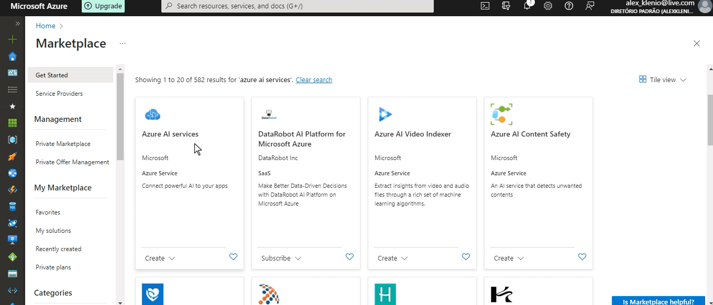
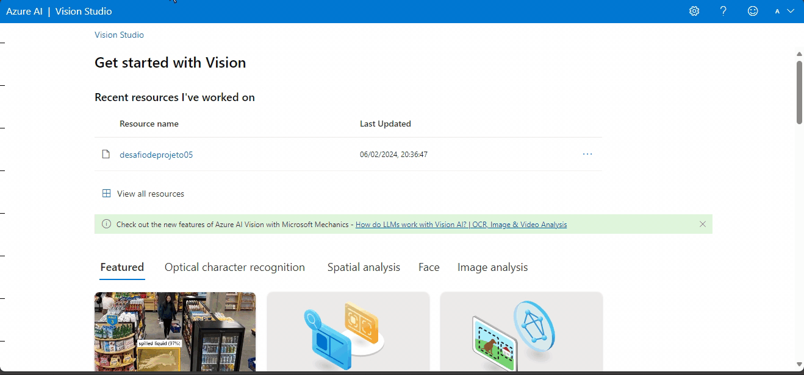
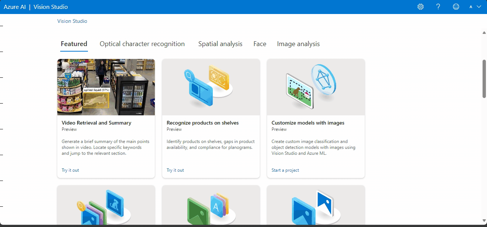
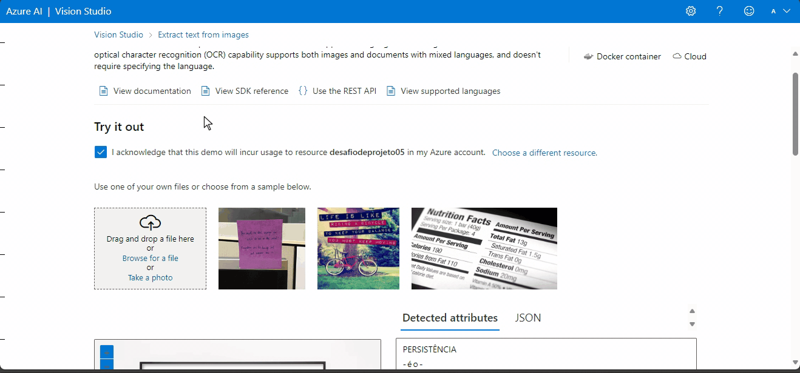
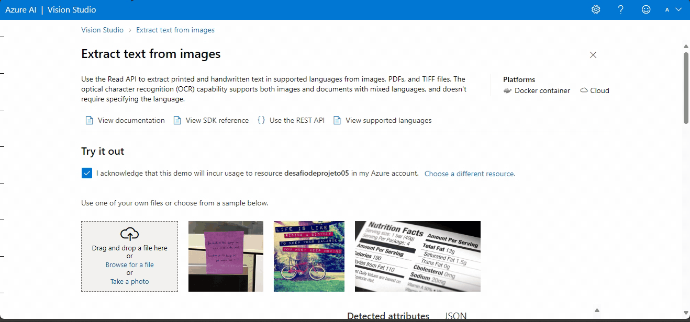
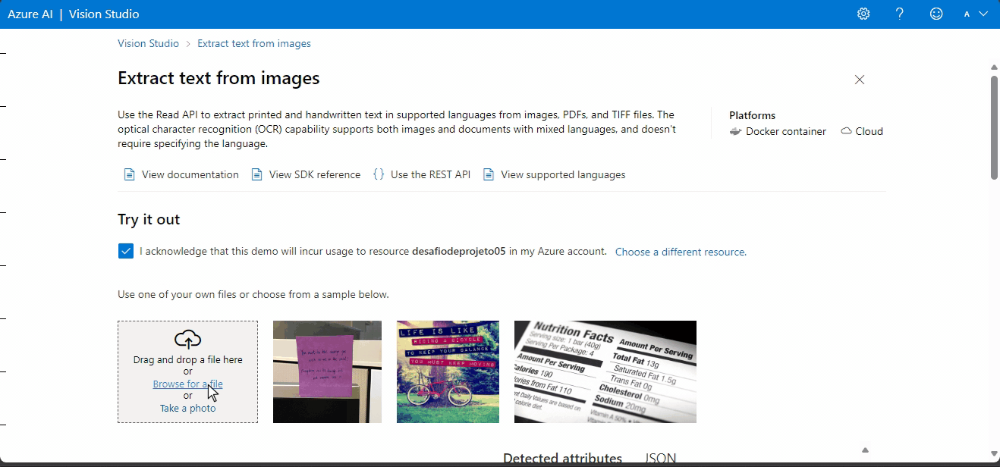
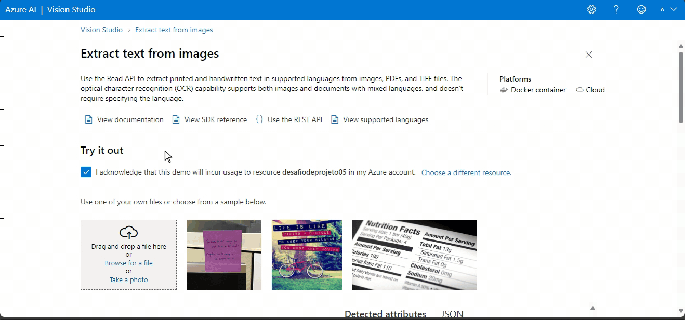

# Explorando os Recursos de IA Generativa

Nos últimos anos, a Inteligência Artificial (IA) Generativa emergiu como uma área de destaque, revolucionando a forma como interagimos com tecnologias e criamos conteúdo. Nesse cenário, a Microsoft Azure desponta como uma plataforma líder, oferecendo uma ampla gama de recursos e ferramentas para explorar e impulsionar o potencial da IA Generativa.

Desde a geração de imagens até a criação de música e texto, os recursos disponíveis no Microsoft Azure capacitam desenvolvedores, empresas e pesquisadores a inovar de maneiras antes inimagináveis. Este texto explorará como aproveitar ao máximo esses recursos, destacando as vantagens, possibilidades e aplicações práticas da IA Generativa na plataforma Azure.

## Situação problema

Como parte do programa de capacitação em tecnologia, propõe-se a utilização dos recursos de IA disponíveis no Microsoft Azure para reconhecer textos presentes em imagens.

### Passo a Passo:

1. Organização dos Dados: Inicialmente, é recomendado criar uma pasta denominada 'inputs' para armazenar as imagens a serem processadas. Posteriormente, os resultados do reconhecimento de texto serão salvos na pasta 'outputs'.

2. Configuração do Recurso Azure AI Vision Studio: É necessário criar um recurso no Azure dedicado aos serviços de inteligência artificial. Este processo é realizado através do Marketplace, onde se busca pelo Azure AI Services e se procede com a criação do recurso.

3. Acesso e Configuração do Portal AI Vision Studio: Após a criação do serviço de inteligência artificial, é fundamental acessar o Azure AI Vision Studio. No portal, seleciona-se o serviço previamente criado, preparando assim o ambiente para a utilização das imagens.

4. Utilização dos Recursos do Azure AI Vision Studio: Com todas as configurações realizadas, o próximo passo é utilizar as funcionalidades disponíveis. Na seção de Reconhecimento Óptico de Caracteres (OCR), seleciona-se a opção para extrair texto das imagens.

### Resultados

A seguir, são apresentadas as imagens utilizadas no processo de reconhecimento de texto:

#### Imagem 01

#### Imagem 02

#### Imagem 03

#### Imagem 04

#### Imagem 05

## Considerações finais

O laboratório de implementação do reconhecimento de texto em imagens utilizando os recursos de IA do Microsoft Azure proporcionou uma experiência enriquecedora e reveladora. Ao longo deste processo, foi possível explorar de forma prática e eficiente as capacidades da plataforma Azure AI Vision Studio, demonstrando sua aplicabilidade e poder transformador.

Durante a execução do laboratório, foram abordados diversos aspectos, desde a configuração inicial do recurso no Azure até a utilização das funcionalidades de reconhecimento óptico de caracteres (OCR) para extrair texto de imagens. Este processo evidenciou a acessibilidade e a intuitividade das ferramentas disponíveis, facilitando a implementação de soluções inteligentes e inovadoras.

Além disso, ao trabalhar com casos reais de reconhecimento de texto em diferentes imagens, foi possível compreender a versatilidade e a robustez dos algoritmos de IA subjacentes, que conseguiram lidar eficazmente com uma variedade de cenários e tipos de texto.

Em suma, este laboratório não apenas proporcionou uma introdução prática aos recursos de IA do Microsoft Azure, mas também inspirou a exploração contínua e a utilização criativa dessas tecnologias para resolver desafios do mundo real. A combinação de recursos acessíveis, poder computacional e suporte técnico disponíveis na plataforma Azure cria um ambiente propício para a inovação e o desenvolvimento de soluções inteligentes em diversas áreas de aplicação.
